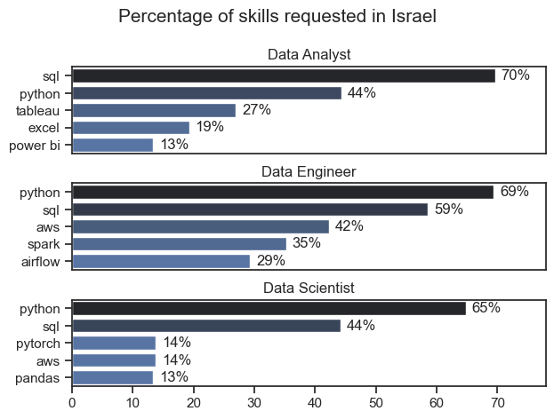
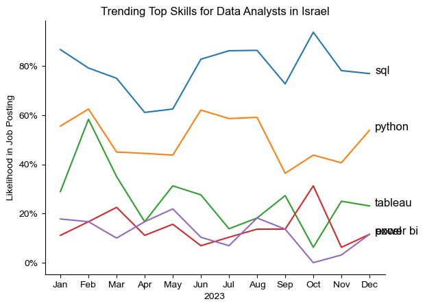
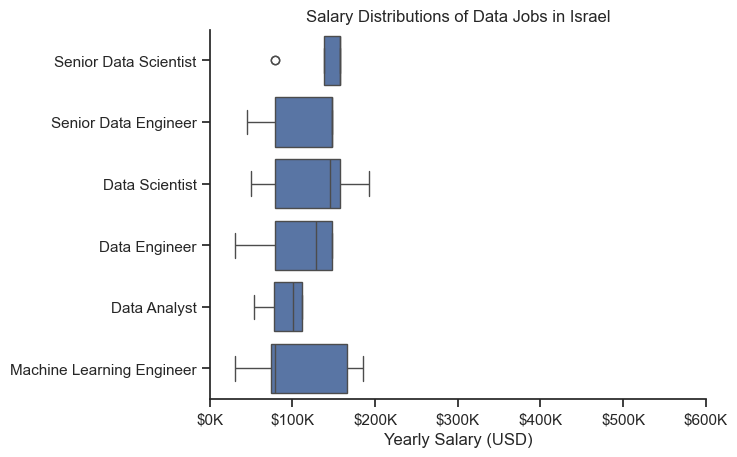
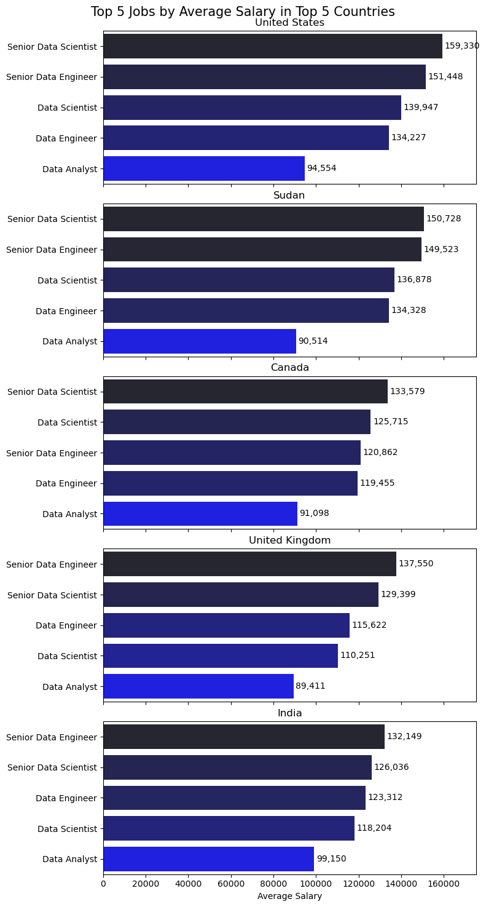

# Overview

Welcome to my analysis of the data job market. This project was created out of a desire to navigate and understand the job market more effectively. It delves into the top-paying and in-demand skills to help find optimal job opportunities.

The data sourced from [Luke Barousse's Python Course](https://lukebarousse.com/python) which provides a foundation for my analysis, containing detailed information on job titles, salaries, locations, and essential skills. Through a series of Python scripts, I explore key questions such as the most demanded skills, salary trends, and the intersection of demand and salary in data analytics.

# The Questions

Below are the questions I want to answer in my project:

1. What are the skills most in demand for the top 3 most popular data roles in Israel?
2. How are in-demand skills trending for Data Analysts in Israel?
3. How well do data jobs pay for in Israel?
4. What are the average salaries for different jobs, in different locations.

# Tools I Used

For my deep dive into the data analyst job market, I harnessed the power of several key tools:

- **Python:** The backbone of my analysis, allowing me to analyze the data and find critical insights.I also used the following Python libraries:
    - **Pandas Library:** This was used to analyze the data. 
    - **Matplotlib Library:** I visualized the data.
    - **Seaborn Library:** Helped me create more advanced visuals. 
- **Jupyter Notebooks:** The tool I used to run my Python scripts which let me easily include my notes and analysis.
- **Visual Studio Code:** My go-to for executing my Python scripts.
- **Git & GitHub:** Essential for version control and sharing my Python code and analysis, ensuring collaboration and project tracking.

# Data Preparation and Cleanup

This section outlines the steps taken to prepare the data for analysis, ensuring accuracy and usability.

## Import & Clean Up Data

I start by importing necessary libraries and loading the dataset, followed by initial data cleaning tasks to ensure data quality.

```python
# Importing Libraries
import ast
import pandas as pd
import seaborn as sns
from datasets import load_dataset
import matplotlib.pyplot as plt  

# Loading Data
dataset = load_dataset('lukebarousse/data_jobs')
df = dataset['train'].to_pandas()

# Data Cleanup
df['job_posted_date'] = pd.to_datetime(df['job_posted_date'])
df['job_skills'] = df['job_skills'].apply(lambda x: ast.literal_eval(x) if pd.notna(x) else x)
```

## Filter Israel Jobs

To focus my analysis on the Israeli job market, I apply filters to the dataset, narrowing down to roles based in the United States.

```python
df_IL = df[df['job_country'] == 'Israel']

```

# The Analysis

Each Jupyter notebook for this project aimed at investigating specific aspects of the data job market. Here’s how I approached each question:

## 1. What are the skills most in demand for the top 3 most popular data roles in Israel?

To find the most demanded skills for the top 3 most popular data roles. I filtered out those positions by which ones were the most popular, and got the top 5 skills for these top 3 roles. This query highlights the most popular job titles and their top skills, showing which skills I should pay attention to depending on the role I'm targeting. 

View my notebook with detailed steps here: [2_Skills_Demand](2_Skills_Demand.ipynb).

### Visualize Data

```python
fig, ax = plt.subplots(len(job_titles), 1)


for i, job_title in enumerate(job_titles):
    df_plot = df_skills_perc[df_skills_perc['job_title_short'] == job_title].head(5)[::-1]
    sns.barplot(data=df_plot, x='skill_percent', y='job_skills', ax=ax[i], hue='skill_count', palette='dark:b_r')

plt.show()
```

### Results



*Bar graph visualizing the salary for the top 3 data roles and their top 5 skills associated with each.*

### Insights:

- SQL is the most requested skill for Data Analysts and Data Engineers, appearing in job postings 70% & 59%, respectively. For Data Scientists, Python is the most sought-after skill, appearing in 65% of job postings.
- Data Engineers require more specialized technical skills (AWS, Azure, Spark) compared to Data Analysts and Data Scientists who are expected to be proficient in more general data management and analysis tools (Excel, Tableau).
- Python is a versatile skill, highly demanded across all three roles, but most prominently for Data Scientists (65%) and Data Engineers (69%).

## 2. How are in-demand skills trending for Data Analysts?

To find how skills are trending in 2023 for Data Analysts, I filtered data analyst positions and grouped the skills by the month of the job postings. This got me the top 5 skills of data analysts by month, showing how popular skills were throughout 2023.

View my notebook with detailed steps here: [3_Skills_Trend](3_Skills_Trend.ipynb).

### Visualize Data

```python

from matplotlib.ticker import PercentFormatter

df_plot = df_DA_IL_percent.iloc[:, :5]
sns.lineplot(data=df_plot, dashes=False, legend='full', palette='tab10')

plt.gca().yaxis.set_major_formatter(PercentFormatter(decimals=0))

plt.show()

```

### Results

  
*Bar graph visualizing the trending top skills for data analysts in Israel in 2023.*

### Insights:
- SQL & Python remain the most consistently demanded skills throughout the year.
- Tableau showed an increase in February, but slowly declined during the year
- Power BI & Excel remained mostly steady at around 15% of job offers.

## 3. How well do jobs and skills pay for Data Analysts?

To identify the highest-paying roles and skills, I only got jobs in Israel and looked at their median salary. But first I looked at the salary distributions of common data jobs like Data Scientist, Data Engineer, and Data Analyst, to get an idea of which jobs are paid the most. 

View my notebook with detailed steps here: [4_Salary_Analysis](4_Salary_Analysis.ipynb).

#### Visualize Data 

```python
sns.boxplot(data=df_IL_top6, x='salary_year_avg', y='job_title_short', order=job_order)

ticks_x = plt.FuncFormatter(lambda y, pos: f'${int(y/1000)}K')
plt.gca().xaxis.set_major_formatter(ticks_x)
plt.show()

```

#### Results

  
*Box plot visualizing the salary distributions for the top 6 data job titles.*

#### Insights

- Out of the 4887 job listings in Israel, only 113 had information about the average yearly salary. Israeli companies do not like to show the salary in advance, as it might be a more private subject there.

- The jobs are sorted by the median income, meaning the highest median income are the Senior Data Scientists. Although some regular Data Scientists & Machine Learning Engineers earn more

- Data Scientists have the widest boxplots, showing a difference in over $150k.

### 4. What are the average salaries for different jobs, in different locations.

To find out the average salaries for different jobs in different locations, I filtered the data according to the top 5 countries with the most job listings. For every country, The job titles with the most listings were chosen.


View my notebook with detailed steps here: [5_Avg_Salary](3_Avg_Salary.ipynb).

### Visualize Data

```python
fig, ax = plt.subplots(len(DF_pivottable2.index), 1, figsize=(8, 15), sharex=True)

# Plot the top 5 jobs for each of the top 5 countries
for i, country in enumerate(DF_pivottable2.index):
    df_plot = DF_pivottable2.loc[country].reset_index()
    df_plot.columns = ['job_title_short', 'salary_year_avg']
    df_plot = df_plot.sort_values(by='salary_year_avg', ascending=False)  # Sort by salary_year_avg in descending order
    sns.barplot(data=df_plot, x='salary_year_avg', y='job_title_short', ax=ax[i], palette='dark:b_r',hue='salary_year_avg')
    ax[i].set_title(country)
    ax[i].set_ylabel('')
    ax[i].set_xlabel('Average Salary')
    ax[i].get_legend().remove()
    ax[i].set_xlim(0, DF_pivottable2.values.max() * 1.1)  # Adjust x-axis limit for better readability

    # Label the salary on the bars
    for n, v in enumerate(df_plot['salary_year_avg']):
        ax[i].text(v + 1000, n, f'{v:,.0f}', va='center')

# Set common labels
fig.suptitle('Top 5 Jobs by Average Salary in Top 5 Countries', fontsize=15)
fig.tight_layout(h_pad=0.5)
plt.show()
```

#### Results

  
*Bar chart visualising the average salaries for different job titles*

#### Insights

- For all countries (with the exception of Canada), the Senior roles have a higher salary than junior/mid-level roles

- The United States has the highest salaries by far, having an average salary of $160,000 for a Senior Data Scientist.

- India, although having the lowest salaries, has a fairer distribution of it. With only a $33,000 difference between the top & bottom roles. In the US thats a $65,000 difference


# What I Learned

Throughout this project, I deepened my understanding of the data analyst job market and enhanced my technical skills in Python, especially in data manipulation and visualization. Here are a few specific things I learned:

- **Advanced Python Usage**: Utilizing libraries such as Pandas for data manipulation, Seaborn and Matplotlib for data visualization, and other libraries helped me perform complex data analysis tasks more efficiently.
- **Data Cleaning Importance**: I learned that thorough data cleaning and preparation are crucial before any analysis can be conducted, ensuring the accuracy of insights derived from the data.
- **Strategic Skill Analysis**: The project emphasized the importance of aligning one's skills with market demand. Understanding the relationship between skill demand, salary, and job availability allows for more strategic career planning in the tech industry.


# Insights

This project provided several general insights into the data job market for analysts:

- **Skill Demand and Salary Correlation**: There is a clear correlation between the demand for specific skills and the salaries these skills command. Advanced and specialized skills like Python and Oracle often lead to higher salaries.
- **Market Trends**: There are changing trends in skill demand, highlighting the dynamic nature of the data job market. Keeping up with these trends is essential for career growth in data analytics.
- **Economic Value of Skills**: Understanding which skills are both in-demand and well-compensated can guide data analysts in prioritizing learning to maximize their economic returns.


# Challenges I Faced

This project was not without its challenges, but it provided good learning opportunities:

- **Data Inconsistencies**: Handling missing or inconsistent data entries requires careful consideration and thorough data-cleaning techniques to ensure the integrity of the analysis.
- **Complex Data Visualization**: Designing effective visual representations of complex datasets was challenging but critical for conveying insights clearly and compellingly.
- **Balancing Breadth and Depth**: Deciding how deeply to dive into each analysis while maintaining a broad overview of the data landscape required constant balancing to ensure comprehensive coverage without getting lost in details.


# Conclusion

This exploration into the data analyst job market has been incredibly informative, highlighting the critical skills and trends that shape this evolving field. The insights I got enhance my understanding and provide actionable guidance for anyone looking to advance their career in data analytics. As the market continues to change, ongoing analysis will be essential to stay ahead in data analytics. This project is a good foundation for future explorations and underscores the importance of continuous learning and adaptation in the data field.


